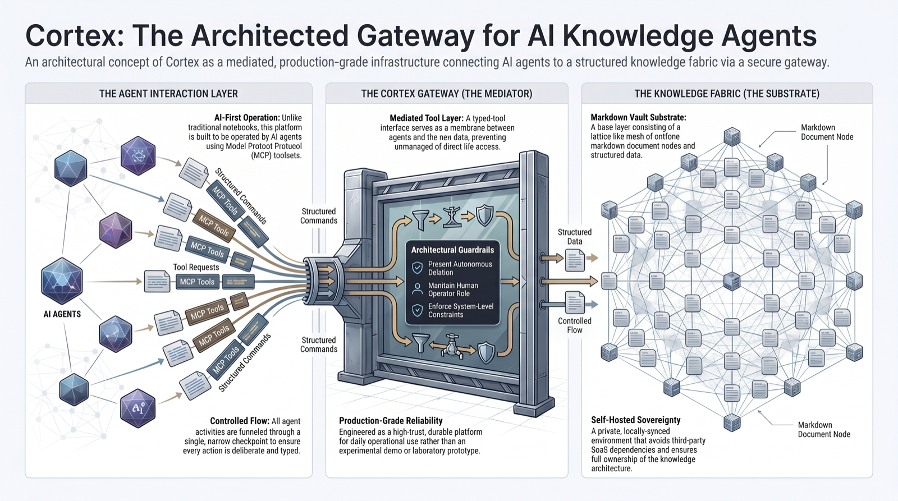
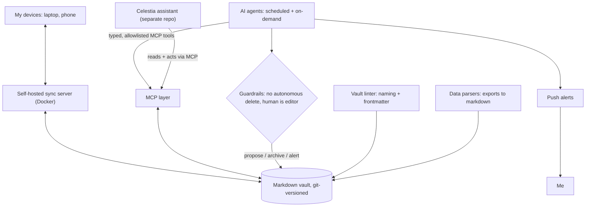

# Cortex

**A self-hosted knowledge platform built to be operated by AI agents, not just read by a human.**

**[▶ See Cortex in motion](https://github.com/janvrsinsky/jv-obsidian-assistant)**: the Celestia assistant operating this platform live over a sanitized copy of the vault (a morning brief assembled across the vault, a business update written into the right note).


Cortex is a markdown vault wired into an AI-agent stack. It runs on my own infrastructure, it is the system I run my working life out of every day, and it is the platform the [Celestia assistant](https://github.com/janvrsinsky/jv-obsidian-assistant) sits on top of. This repo documents the architecture and ships a runnable piece of its tooling. It does not contain any vault content.

---

## What it is

A plain-markdown vault (thousands of notes) turned into something agents can act on safely: a typed [MCP](https://modelcontextprotocol.io) layer so agents search, read, and write through auditable tools instead of raw filesystem access; a self-hosted sync server so every device shares one source of truth; scheduled and on-demand agents that triage captures, surface dated commitments, and push an alert when something needs a human; and Python tooling that keeps thousands of notes structurally honest.

The design bet is that the durable engineering is the vault, the tool layer, and the guardrails. The chat front end on top is replaceable.

## What is real, and what ships here

Being precise about this matters, so here it is plainly.

- **Real and in production.** The platform runs daily on my own infrastructure with one real user who depends on it: me. The sync server, the MCP tools, the agent workflows, and the linter are live.
- **Not in this repo.** No vault content, no real linter rules, no real paths, no private data. Nothing personal leaves the system. This is an architecture-and-tooling repo, by design.
- **Runnable here.** A clean-room re-creation of the vault linter, built from scratch on synthetic data. It ships a small sample directory of fixtures (some valid notes, some deliberately broken) and lints it, so you can see the tooling approach without any private content. See [Correctness and safety](#correctness-and-safety).

## See it in motion

Cortex in motion lives one layer up, in [Celestia](https://github.com/janvrsinsky/jv-obsidian-assistant): an assistant persona with an MCP filesystem core running over a sanitized copy of this vault. Its recorded demos (a morning brief assembled across the whole vault, a business update written into the correct note) show this platform doing real work. This repo is the engine underneath.

---

## How it works

The architecture is a short list of decisions, each one made before any code was generated.

**Markdown is the substrate, not a database.** Every note is a plain file: human-editable, diffable, and versioned in git. No proprietary store to migrate off, and history is a real safety net.

**Frontmatter is the query layer.** Anything worth filtering on lives in YAML at the top of a note, not buried in prose. That is what makes an unstructured pile of notes queryable by an agent.

**Agents get typed tools, not root.** Everything an agent does goes through allowlisted MCP tools (search, read, write). Actions stay observable and reversible; there is no raw filesystem handed to a model.

**Sync is self-hosted.** A server in Docker keeps laptop and phone on one source of truth, without a third-party cloud in the loop.

**The human stays the editor.** Automation proposes, archives, and alerts. Deciding and deleting stay with me. No autonomous delete is an invariant, not a preference.

**Capture is immediate, state stays honest.** Updates land the moment they happen; automation flags drift and stale records instead of papering over them, and pushes an alert when something cannot wait.



---

## Stack

| Component | Purpose |
|---|---|
| **Markdown vault (Obsidian)** | The substrate: plain, git-versioned, human-editable files. |
| **MCP layer** | Custom Model Context Protocol servers giving agents typed, allowlisted tools (search, read, write) with an audit surface instead of raw access. |
| **Self-hosted sync server (Docker)** | One source of truth across devices, no third-party cloud. |
| **Agent workflows** | Scheduled and on-demand agents that triage the capture inbox, surface dated commitments, and watch for stale state. |
| **Push alerting** | Reaches my devices when an automated run finds something a human has to see. |
| **Python tooling** | A vault linter that enforces naming and frontmatter across thousands of notes, plus parsers that turn data exports into clean markdown. |
| **Git** | The vault is versioned end to end; automation proposes and archives, and history is the fallback. |

---

## Correctness and safety

A knowledge platform is trusted for the guarantees it can make about what it will and will not do, not for a benchmark number. Cortex leans on four of them.

**Structure is enforced by tooling, not by discipline.** A linter checks naming conventions and required frontmatter across the whole vault, so conventions hold mechanically at thousands of notes rather than depending on anyone remembering them. This repo ships a clean-room version of that idea:

```bash
python examples/vault_linter_concept.py
```

It lints a bundled sample directory of fixtures (some valid notes, some deliberately broken), checking naming (kebab-case filenames) and structure (frontmatter with required keys), and reports each violation with a file and a reason. Standard library only, no dependencies.

**Actions go through typed tools.** Agents reach the vault through allowlisted MCP tools, so every read and write is observable and bounded. There is no path for an agent to touch the filesystem outside that surface.

**Nothing is deleted autonomously.** Automation archives; the human purges. That single invariant means a bad automated run degrades into clutter to clean up, never into lost data.

**State stays honest.** Rather than silently reconciling a stale or conflicting record, automation flags it and, when it matters, pages me. The system is designed to fail loud.

Where a consumer of a platform like this genuinely needs retrieval quality, that is a question you measure rather than assume. I did exactly that in a sibling project (a podcast RAG lab with a hand-built gold set and recall@k / MRR numbers across keyword, dense, and hybrid retrieval); it lives separately on my [profile](https://github.com/janvrsinsky). Cortex itself is a structure-and-safety story, and I am keeping the two honest and distinct.

---

## How it is built

Built AI-first: I direct tools like Claude Code to generate and refactor the code while I own the architecture, the tool boundaries, and the failure modes, then read, run, and debug what ships. Twenty-five years building software is what tells me where a system like this rots and what "runs unattended" actually costs.

---

## Status and contact

**Production.** In daily use as the platform underneath [Celestia](https://github.com/janvrsinsky/jv-obsidian-assistant), and one of a set of systems I build on the same shape: typed MCP tools, guardrails in code, and a human in the loop.

- Portfolio: [github.com/janvrsinsky](https://github.com/janvrsinsky)
- LinkedIn: [linkedin.com/in/janvrsinsky](https://linkedin.com/in/janvrsinsky)
