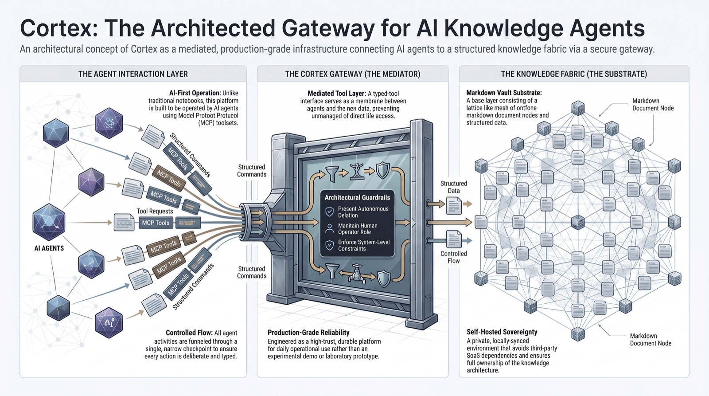
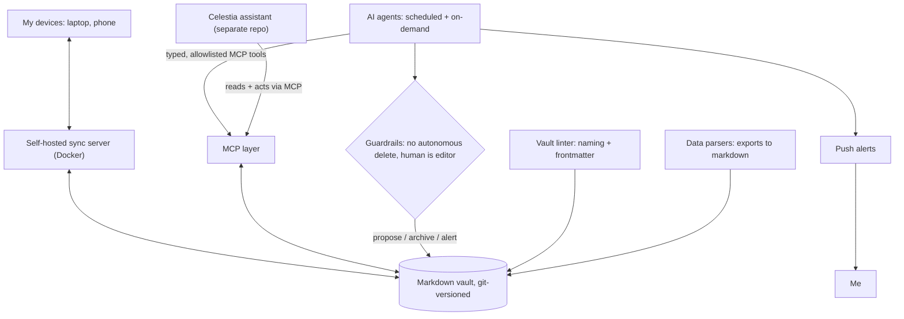

# Cortex

**A self-hosted knowledge platform operated by AI agents.**

**Portfolio exhibit.** This is a sanitized public extract of a private system in daily use. The architecture and method are real; the data and identifiers are stand-ins, and [What is real, and what ships here](#what-is-real-and-what-ships-here) lists which is which.

[](https://github.com/janvrsinsky/jv-cortex-platform/actions/workflows/ci.yml)


**[▶ See Cortex in motion](https://github.com/janvrsinsky/jv-obsidian-assistant)**: the Celestia assistant operating this platform live over a sanitized copy of the vault (a morning brief assembled across the vault, a business update written into the right note).

Cortex is a plain-markdown vault (thousands of notes, Obsidian on top) wired into an AI-agent stack: typed, allowlisted [MCP](https://modelcontextprotocol.io) tools for every agent action, a self-hosted sync server keeping every device on one source of truth, scheduled and on-demand agents that triage captures, surface dated commitments, and push an alert when a human has to see something, and Python tooling (a vault linter plus parsers that turn data exports into clean markdown). The durable engineering is the vault, the tool layer, and the guardrails; the chat front end on top is replaceable.

Deeper docs: [architecture](docs/architecture.md) · [MCP layer](docs/mcp-layer.md) · [runnable example](examples/README.md)

## What is real, and what ships here

- **Real and in production.** The platform runs daily on my own infrastructure with one real user who depends on it: me. The sync server, the MCP tools, the agent workflows, and the linter are live.
- **Not in this repo.** No vault content, no real linter rules, no real paths, no private data. This is an architecture-and-tooling repo, by design.
- **Runnable here.** A clean-room re-creation of the vault linter, built from scratch on synthetic data. See [Run the example](#run-the-example).

## How it works

Six decisions, each made before any code:

- **Markdown is the substrate.** Every note is a plain file: human-editable, diffable, versioned in git, with no proprietary store to migrate off.
- **Frontmatter is the query layer.** Anything worth filtering on lives in YAML at the top of a note, which makes an unstructured pile of notes queryable by an agent.
- **Agents get typed tools.** Everything an agent does goes through allowlisted MCP tools (search, read, write): observable, bounded, reversible, and never raw filesystem access.
- **Sync is self-hosted.** A server in Docker keeps laptop and phone on one source of truth without a third-party cloud.
- **The human stays the editor.** Automation proposes, archives, and alerts; deciding and deleting stay with me. No autonomous delete is an invariant, so a bad automated run degrades into clutter to clean up, never into lost data.
- **State stays honest.** Updates land the moment they happen; automation flags drift and stale records instead of silently reconciling them, and pages me when something cannot wait. The system fails loud.


```mermaid
flowchart TB
    DEV["My devices: laptop, phone"] <--> SYNC["Self-hosted sync server (Docker)"]
    SYNC <--> V[("Markdown vault, git-versioned")]

    AG["AI agents: scheduled + on-demand"] -->|"typed, allowlisted MCP tools"| MCP["MCP layer"]
    MCP <--> V
    AG --> G{"Guardrails: no autonomous delete, human is editor"}
    G -->|"propose / archive / alert"| V
    AG --> PUSH["Push alerts"]
    PUSH --> H["Me"]

    LINT["Vault linter: naming + frontmatter"] --> V
    PARS["Data parsers: exports to markdown"] --> V

    ASSIST["Celestia assistant (separate repo)"] -->|"reads + acts via MCP"| MCP
```

## Run the example

The private linter enforces naming conventions and required frontmatter across thousands of notes, so structure holds mechanically; this repo ships a clean-room version of that idea:

```bash
python examples/vault_linter_concept.py
```

It lints a bundled sample directory of fixtures (some valid notes, some deliberately broken), checking naming (kebab-case filenames) and structure (frontmatter with required keys), and reports each violation with a file and a reason. Standard library only, no dependencies. `test_linter.py` pins every rule with 28 checks, covering the verdict over the fixtures and each rule fired in isolation, and GitHub Actions runs them on every push.

Retrieval quality gets measured, in a sibling project on my [profile](https://github.com/janvrsinsky): a podcast RAG lab with a hand-built gold set and recall@k / MRR numbers across keyword, dense, and hybrid retrieval. Cortex itself is a structure-and-safety story.

## Status and contact

**PRODUCTION EXTRACT.** A sanitized public cut of a private system in real use. The architecture and method are real; data, names and some components are stand-ins, and the README lists which is which. In daily use as the platform underneath [Celestia](https://github.com/janvrsinsky/jv-obsidian-assistant), one of a set of systems built on the same shape: typed MCP tools, guardrails in code, and a human in the loop. The architecture, the tool boundaries, and the failure modes are mine; twenty-five years building software is what tells me where a system like this rots and what "runs unattended" actually costs.

- Portfolio: [github.com/janvrsinsky](https://github.com/janvrsinsky)
- LinkedIn: [linkedin.com/in/janvrsinsky](https://linkedin.com/in/janvrsinsky)

## Topics


